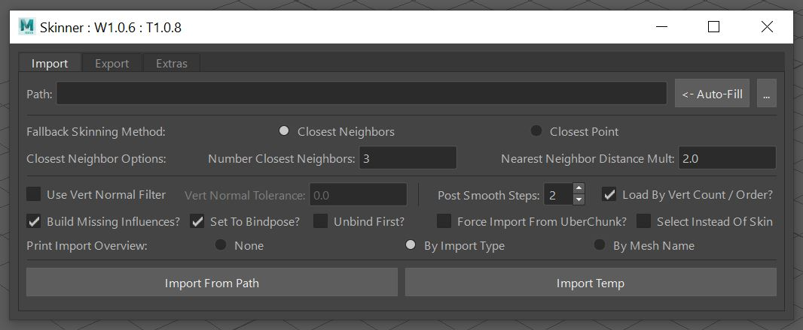
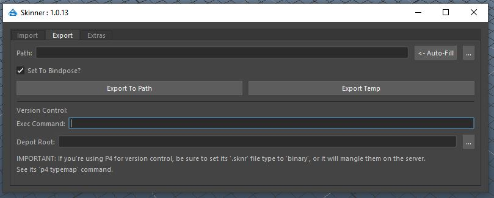
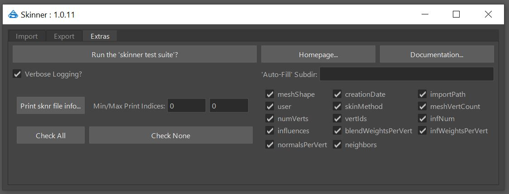

**Table Of Contents**
- [Overview](#overview)
  * [Export Features](#export-features)
  * [Import Features](#import-features)
  * [Other Features](#other-features)
  * [Usage Examples](#usage-examples)
  * [Why this tool](#why-this-tool)
  * [Similar Tools](#similar-tools)
- [Help](#help)
- [Requirements](#requirements)
- [Integrating Into Your Pipeline](#integrating-into-your-pipeline)
- [Access the Maya Tool UI](#access-the-maya-tool-ui)
  * [Tool UI Overview](#tool-ui-overview)
    + [Import Tab](#import-tab)
    + [Export Tab](#export-tab)
    + [Extras Tab](#extras-tab)
- [Skinner Concepts](#skinner-concepts)
  * [The .sknr file format](#the-sknr-file-format)
  * [SkinChunks and UberChunks](#skinchunks-and-uberchunks)
- [Using the Skinner API](#using-the-skinner-api)

# Overview
Skinner is a tool for Autodesk Maya designed to make "exporting and importing skin weights on polygonal mesh fast, easy, and full featured".  Having both a consumer-facing UI and scriptable API, it can be fully integrated into a professional production pipeline regardless of industry.

At high level, the Skinner tool works by exporting & importing ‘SkinChunk’ data, discussed below.

## Export Features
* Can export based on any combination of mesh/joint/vert/transform selection : It’s all converted into per-mesh ‘SkinChunk’ information for storage.
* Can export as many mesh/verts (as SkinChunk data) to a single .sknr file as needed.
* Can ‘set to bindpose’ before export, or not.

## Import Features
* Can import from multiple .sknr files at the same time & merge the data.
* Can import onto any combination of mesh/joints/vert/transform selection.  They’re all converted into mesh:vert chunks for import.
* Robust logic tree when importing, based on the ‘Fallback Skinning Method’ (**FSM**) defined: It can either be ‘Closest Neighbors’ (a custom algorithm designed for this system, discussed below) or ‘Closest Point’.
* Options to ‘set to bindpose’, build missing influences (joints), and either unbind first, or append to the current skinning on import.
* Can import weights applying a ‘vert normal filter’ that aids in keeping ‘stretching’ verts at bay.
* High level import logic path, regardless if you’re importing onto multiple mesh, or some vertex selection:
  * Does a leaf mesh name match a SkinChunk name?
    * Yes
      * Does the SkinChunk only have a single influence mesh?
        * Yes
          * Skin to that one joint 100%
        * No
          * Does it have the same vert count/order as the mesh?
            * Yes
              * Import by 1:1 vert IDs
            * No
              * Use that SkinChunk’s point cloud and import by the ‘FSM’.
    * No
        * Can a SkinChunk be found with the same vert count/order as the mesh?
          * Yes
            * Import by 1:1 vert IDs
          * No
            * Generate the UberChunk, using is point cloud, import by the ‘FSM’.

## Other Features
* Supports duplicate mesh names for export/import (the tool converts everything to long/absolute paths)
* Supports Maya’s linear, dual-quat, and weight-blended ‘Skinning Methods’.
* Verbose and robust results printed to the Script Editor / returned by the API for your own pipeline’s consumption.
* Full integration into your teams version control software.
* Introspection/printing of data in the custom .sknr file format (pickled Python data).
* Automated debug test suite you can run to confirm everything is working.
* Speed : Based on testing/profilling against Maya’s [Deformer Weights](https://knowledge.autodesk.com/support/maya/learn-explore/caas/CloudHelp/cloudhelp/2022/ENU/Maya-CharacterAnimation/files/GUID-A3079688-8A42-4C82-A3CF-070D95A9CE6F-htm.html) system, while it appears to export at roughly the same speed, it can be up to 5-10x faster on import, and provides substantially more options / ease of use.
* Verbose docstrings for all classes, methods, and functions, to be used with Pythons help function.

## Usage Examples
* Integrate into a rebuildable asset pipeline:
  * After skinning is performed on your ‘SkeletalMesh’ scene, export that Skinner data to disk.
  * Update mesh poly counts, names, etc in your ‘StaticMesh’ scene.
  * Via your pipeline code, When you regenerate your SkekeletalMesh from the StaticMesh, the Skinner tool handles all the mesh name changes, etc, loading weights onto matching mesh names where it can, and interpolating weights for new mesh / renamed mesh.
* You have good arm skinning in sceneA, and want to copy it to only a section of an arm in sceneB:
  * In sceneA, select just the verts you want to copy the skinning data on (could be on multiple mesh), and ‘export temp’.
  * In sceneB, select just the verts you want to copy the skinning data on (could be multiple mesh), and ‘import temp’.
* You want to copy skinning off sceneA to sceneB, but you know that sceneA has many joints that sceneB doesn’t:
  * That’s ok, just make sure you have ‘build missing influences’ checked during import, and the missing joints will be created/parented into the hierarchy for you.
* You’re copying skinning from one pair of ‘skinny jeans’ to a pair of ‘MC-hammer pants’: After you do, you transform the hip joints, and there are many ‘stretching verts’ between the legs, where the parachute-pants overlap.  No problem, reimport with the ‘Vert Normal Filter’ enabled to resolve this.
* You want to copy the weights between two mesh, that are the same topology, but different names, no problem:  Make sure “Load by vert count/order” is checked, and it’ll transfer the weights 1:1.
* You can generate a ‘weight depot’ on a server: Update your Skinner export pipeline code to export a .sknr file per mesh to the server, with the filename * “<leafMeshName>_<vertCount>.sknr” during export.  You’ve authored custom wrapper import code that for each mesh, see if it can find a name match in the .sknr files : If it does, load that data. If it doesn’t, find all the vertCount matches : For those matches, check and see if the vert order matches, and if so, load that data, regardless of name mismatch.
* Something it doesn’t do? Let me know for improvement. 
 
## Why this tool
I’ve been rigging & skinning in Maya since v1 (other DCC apps previous to that), full time techart since before it had a industry name, and shipped multiple best-selling AAA titles.  https://www.linkedin.com/in/pavey/
 
Having built entire art -> engine pipelines for multiple studios, with fully procedurally built rigging solutions, one of the biggest areas that is missing in Maya is a solid skin weight export/import process.  This tool aims to alleviate any issues for the techart team regardless of industry.  It is in-use and proven in AAA game production.
 
It is closed source code:  You are welcome to use it for your benefit for free without restriction, but the secret sauce is kept behind the counter.
 
## Similar Tools
If you are the author of any of the below tools and feel I have represented your software inaccurately, please let me know.
* Maya provided tools
  * [Deformer Weights](https://knowledge.autodesk.com/support/maya/learn-explore/caas/CloudHelp/cloudhelp/2022/ENU/Maya-CharacterAnimation/files/GUID-A3079688-8A42-4C82-A3CF-070D95A9CE6F-htm.html)
    * Skinner outperforms on speed, and provides a substantially better UI, and overall feature set.
  * [Weight Maps Export](https://knowledge.autodesk.com/support/maya/learn-explore/caas/CloudHelp/cloudhelp/2022/ENU/Maya-CharacterAnimation/files/GUID-7681F977-32D2-4FE4-A83D-E1C9FB2B402F-htm.html), [Weight Map Import](https://knowledge.autodesk.com/support/maya/learn-explore/caas/CloudHelp/cloudhelp/2022/ENU/Maya-CharacterAnimation/files/GUID-DD0E4715-294F-43EF-A70B-1EAD8389CA0E-htm.html)
    * This export skin weights as 2d images, but is entirely predicated on good/non-overlapping UV’s.  Skinner has substantially better import options available.
* [ngSkinTools](https://www.ngskintools.com/)
  * Provides an interesting way to paint skin weights, but provides a limited featureset for exporting/importing of those weights.
  * Skinner would be a good compliment to this system.
* [mGear](http://www.mgear-framework.com/)
  * A robust procedural rigging solution, also includes code for skin weight export & import.
  * I’ve not researched the specifics, but even in [the docs](https://mgear4.readthedocs.io/en/latest/official-unofficial-workflow.html), they discuss using the ngSkin tools as part of their process.
  * API docs for skinning [here](http://www.mgear-framework.com/mgear_dist/mgear/core/skin.html).  The docs list ‘This module is derived from Chad Vernon’s Skin IO’, [here](https://github.com/chadmv/cmt/tree/master/scripts/cmt/deform).
  * Skinner would be good compliment to this system.
* Others? Let me know.

# Help
Please log problems & requests in the **Issues** section of this github.
 
I have a full time job, and work on this in my spare time.  By using it you accept the fact that you are at the mercy of my schedule.
 
I welcome all suggestions & ideas for improvement.

# Requirements
* It has been tested on Windows 10.  No reason it shouldn’t work on other OS’s, but no testing has been done.  There has been intent in the code to make it cross-platform compatible.
* Python 3 (Maya 2022+)
* Based on your version of Maya, these Python packages available on Maya’s Python’s path for import:
  * [Numpy](https://numpy.org/)
  * [Scipy](https://scipy.org/)
Maya 2022+ makes it very easy to install new Python packages via pip.  Maya 2022 docs [HERE](https://help.autodesk.com/view/MAYAUL/2022/ENU/?guid=GUID-72A245EC-CDB4-46AB-BEE0-4BBBF9791627).

Here is an example usage for Maya 2022 on Windows 10:

Open cmd shell **as admin** (on Windows at least).
Then line by line:

Install the numpy & scipy packages, one at a time.  Note, it’s important to call to mayapy.exe specificallyto execute it’s version of pip.
```
> C:\Program Files\Autodesk\Maya2022\bin\mayapy.exe -m pip install numpy
> C:\Program Files\Autodesk\Maya2022\bin\mayapy.exe -m pip install scipy
```
You can optionally provide a ‘–target C:\some\path\to\target\dir’ at the end of the above lines if you want to install them to a custom location that Maya sees.

In either case, if the above worked, you should see (using numpy as an example):
```
> Downloading numpy-1.19.5-cp37-cp37m-win_amd64.whl (13.2 MB)
> Successfully installed numpy-1.19.5
```
They should install here by default, unless overridden by the –target arg:
```
C:\Program Files\Autodesk\Maya2022\Python37\Lib\site-packages
```
After restarting Maya, in the Script Editor, confirm the install:
```python
import numpy as np
import scipy as sp
print(np.__file__)
print(sp.__file__)
# C:\Program Files\Autodesk\Maya2022\Python37\lib\site-packages\numpy\__init__.py
# C:\Program Files\Autodesk\Maya2022\Python37\lib\site-packages\scipy\__init__.py
```
# Integrating Into Your Pipeline
All code lives in a /skinner Python package.  If you don't use git to manage code, you can easily install via the provided zip:  
* Download a zip of this repro via the green Code button -> Download zip.
* Open the zip, and extra the /skinner subdir to a location on your Maya-Python sys.path.
* Maya will find it a-ok for import.

To get a list of those paths, execute in the Script Editor:
```python
import sys
for path in sorted(sys.path):
    print(path)
```
To test that you have a successful install via the Maya Script Editor, run the test suite, and see the results:
```python
import skinner.core as skinCore
skinCore.test()
```
You can also access/run the test suite via the UI -> Extras tab.

It should be noted that after install, importing skinner.core will run skinner.utils.confirmDependencies, and will print any errors found to the Script Editor.

# Access the Maya Tool UI
You can launch the Maya Tool UI via this Python code:
```python
import skinner.window as skinWin
skinWin.App()
```
The App call can take multiple different args during creation, to help integrate your studio’s version control, and point to custom docs.  See more on these subjects below.

## Tool UI Overview
The UI is split into three main tabs, discussed below.  At the top, you’ll see your current ‘Window Version’ (W) and ‘Tool Version’ (T).

### Import Tab

The import tab acts on the selected (in any combination) verts, mesh, joints, transform/group nodes. They’re all converted to mesh:vert data, that is compared against the imported SkinChunk data:

* If mesh are selected:  All their verts are included.
* If joints are selected:  The mesh they influence are found, and all their verts are included.
* If verts are selected:  Those verts are included.
* If transform/group nodes are selected:  All child mesh in the full hierarchy are found, and their verts included.
Based on the mesh:vert’s being imported on:
* When .sknr files are imported the imported (target) SkinChunks first try to find a match by leaf mesh name in the (source) mesh:verts
* If they find a name match but the vert count/order differs, or if there is no mesh name match, they use the ‘Fallback Skinning Method’ (FSM) discussed below.
* If a FSM is used by mesh name match, then the FSM will only include the verts in the point cloud of that name matched SkinChunk, for both speed and skinning accuracy.
* If no mesh name match is found, an ‘UberChunk’ is generated that is a point cloud combination of all SkinChunks, and the FSM acts on that UberChunk data.

UI Elements:
* **Pathing**
  *  : The path of the .sknr file(s) to import, based on:
  * Auto Fill : By default, this will be set to the directory of the currently saved scene.  You can update this with custom subdirs via the option in the Extras tab.
  * ‘…’ : Browse to a file(s) to import from.
* **Fallback Skinning Method** (FSM):  A FSM is used when the vert count/order of the source mesh being imported into is different than the target mesh / SkinChunk with stored values.  If they’re the same vert count / order, then the weights are imported 1:1 with no interpolation.  A FSM can act on SkinChunk data (if there is a name match, but no vert count/order match) or on the UberChunk, when there is no name match.
  * Closest Neighbors:  Custom algorithm written for this tool.  After considering barycentric coordinates, I felt there was a better way to calculate weights based on a point cloud of targets.  When this algorithm is used, for each vert needing skinning, this is the process used to generate the new weights:
    * Find the closest target (in the Skin/UberChunk point cloud) vert to the source : Store that distance.  Say, it’s 1.0 cm
    * Based on the ‘Nearest Neighbor Distance Mult’, generate a sphere around the source vert that is (closest vert distance * nearest neighbor distance mult) : In this example, the sphere would have a radius of 2.0 cm / diameter of 4.0 cm
    * Looking within that sphere, find up to the closest ‘Number Closest Neighbors’ target verts. In this example we’ll search for 3 total verts (the closest, + 2 others).
    * Generate distance for each of the target verts found to the source vert : Normalize those distance to all fit from 0 -> 1.0
    * Generate a list of all the influence weights for each of the target verts, and modify their weights based on the normalized distances:  Apply higher priority to closer target verts, lower priority to farther target verts.
    * Apply those weights to the source vert.
  * Closest Point : This is a simple system, that will find the closest target vert to source, and apply it’s saved weights.
* **Use Vert Normal Filter**
  * If enabled, if the FSM is being used:  Try to only find target verts who’s dot product vs the source vert are greater than the provided ‘Vert Normal Tolerance’.  Dot product refresher: 1.0 : Both normals point the same direction. 0: Normal is perpendicular. -1 : Normal is opposite direction.  The default is 0 : This means, match any target vert who’s normal is on the same hemisphere as the source.  If the FSM ‘Closest Neighbors’ is being used, and no matching normals can be found within the search area, it defaults to closest point.
* **Post Smooth Steps:**
  * If a FSM is used, and the vert count of the source mesh being imported onto is greater than the target Skin/UberChunk point cloud being loaded from:  Smooth the resultant skinning based on the number of steps.   This is the same operation as Maya’s ‘Skin -> Smooth Skin Weights’ tool, with the ‘Required Weight Distance’ set to .5, and the ‘Smoothing Operation’ set to this value.
  * Note, this only performs the smooth on source verts that are in different worldspace locations than target verts.  Since if they’re in the same position as an arbitrary target, you want to leave those weight as-is.  Also, if the vert count of the mesh being imported onto is greater than the Skin/UberChunk point cloud being loaded from, no smoothing is performed, since this tends to generate poor results.  Set this value to 0 to disable entirely.
* **Load By Vert Count / Order?**
  * If a FSM is triggered to be used, and this is checked: The tool will search through all the SkinChunks to see if there is one that has the same vert count/order.  If one is found, then the skinning is loaded on 1:1 by vert ID.  If no match is found, or more than one match is found, then the FSM is used based on the point cloud of that Skin/UberChunk.  Usually you want this checked, and it makes it easy to copy skinning between the ‘same mesh’ that has ‘different names’.
* **Build Missing Influences:**
  * If this is checked, and any joints (influences) are missing in the current scene, they will be auto-created during skinning.  They will attempt to parent themselves to their original parents, if found.  Otherwise they’ll be parented to the world.  Note, while their worldspace transformation will match that stored in the SkinChunk data, their translate\rotate\jointOrient values could be different based on parenting.
* **Set To Bindpose:**
  * If this is checked, and if you’re importing  onto mesh that is already skinned:  Set it to bindpose before the import (or if ‘Unbind First’ is checked, below).  If for any reason the bindpose can’t be set, there will be an error.  If there is no dagPose node for that skinCluster/influences, it will be skipped without error.
* **Unbind First?**
  * If this is checked (and after ‘Set To Bindpose’ happens), if any mesh was previously skinned, it will be unskinned before the new weights are imported.  Why would you / wouldn’t you want this checked?
    * Check it: If you encounter certain skin import errors:  I’ve found certain ‘old’ skinCluster data doesn’t like being updated by this tool, and will error.  Checking this will apply ‘new skinning’, and get past that error.  If you’re importing only a subset of vert data onto a ‘whole mesh’ and this is checked, you may ask, how doe all the other verts get skinned?  The tool will first do a ‘default Maya bind’ on the mesh based on the saved influences, then load in the weight on the vert subset.
    * Uncheck it: If you’re copying a subset of vert weight data from one mesh to another, and want to keep the previous skinning on the rest of the mesh that wasn’t selected.
    * Uncheck it: If for some reason your skeleton isn’t in the bindpose, and you want to leave it in that pose when the new weights are imported.
* **Force From UberChunk?**
  * Mostly for testing:  Make everything read in from the UberChunk point cloud using the active FSM.
* **Select Instead Of Skin:**
  * Mostly for testing : If the SkinChunk data you’re importing from was a subset of verts, select the same subset of verts on the source mesh for preview purposes.
* **Print Import Overview:**
  * In addition to ‘verbose logging’ that can be found in the Extras tab:  If this is checked, an ‘overview’ of the import will be printed to the Script Editor.  It has two modes that will change how the data is printed.  It should be noted that regardless of the mode picked, it will group the data by successful/unsuccessful import:
  * By Import Type: This will group the overview by the solution used to import the weights : by vert ID, by FSM, etc.
  * By Mesh Name : This will group the overview by the individual mesh names.
  * Try then and see the Script Editor for the results.
* **Import Buttons**
  * Import From Path : Import from the path set above.
  * Import Temp : Import from the last temp .sknr file saved by the ‘Export Temp’ button in the Export tab.
  
### Export Tab

The export tab acts on the selected (in any combination) verts, mesh, joints, transform/group nodes: All of this is converted in the mesh:vert SkinChunk data during export.

* If mesh are selected:  All their verts are included.
* If joints are selected:  The mesh they influence are found, and all their verts are included.
* If verts are selected:  Those verts are included.
* If transform/group nodes are selected:  All child mesh in the full hierarchy are found, and their verts included.

UI Elements:
* **Pathing:**
  * Path : The path of the .sknr file(s) to import, based on:
  * Auto Fill : By default, this will be set to the directory of the currently saved scene.  You can update this with custom subdirs via the option in the Extras tab.
  * ‘…’ : Browse to a file(s) to import from.
* **Set To Bindpose:**
  * If this is checked :  Set all mesh part of the export to their bindpose before the export.  If for any reason the bindpose can’t be set, there will be an error.
  * Usually you’d want this checked, but if you’re copying off of some pose onto some other similar pose, you’d want it unchecked.
* **Exporting:**
  * Export To Path : Export to the path provided above.
  * Export Temp : Export to a temp file, that can be imported via ‘Import Temp’ in the Import tab.
* **Version Control**
  * This section allows you to integrate this tool into your studios version control Python API.  To date it’s only been tested with Perforce. (See the P4 Python API docs here).
**Exec Command**
* This is your internal python code that should be executed to edit/add the .sknr file to your version control.
* It requires that you embed the Python string formatting (with the surrounding quotes) ‘%s’ into it, as the pathway for this tool to pass the path of the .sknr file to your Python API.
Here is a made up example using a wrapper module/function around Perforce:
```python
import myCompany.myP4Tool as p4Tool; p4Tool.manageFile('%s')
```
Where it’s presumed that the manageFile function will both mark for add or edit the provide file, based on its current server status.
**Depot Root**
* If this is provided, it’s the local path to the root of your version control depot.
* The ‘Exec Command’ will only fire if the .sknr file being exported is somewhere under this path.
For example:
'''
C:/myCompany/myProject/mySourcFiles
'''
NOTE:  You can embed these paths into the UI on launch for your whole team, like so:
```python
import skinner.window as skinWin
skinWin.App(vcExecCmd="import myCompany.myP4Tool as p4Tool; p4Tool.manageFile('%s')", vcDepotRoot="C:/myCompany/myProject/mySourcFiles")
```
That way each individual user won’t have to enter the values… and get them wrong…

**IMPORTANT :**
* As shown in the UI:  If you’re using Perforce for version control (and this could equally apply to other VC apps like git, subversion, mercurial, etc, but they are untested) : You need to tell your VC software that the ‘.sknr’ file type is binary.
* By default, many will add new file types as ascii, and this will corrupt the .sknr data once on the server.  Your local file will work fine, but anyone else that pulls down a version (or if you sync to someone else’s version), it will be broken.
* For Perforce, see the p4 typemap command to switch these types, or talk to your VC administrator for a site-wide update.
* Remember: When you add a new .sknr file to your VC software, before you submit, confirm its file type is binary!

### Extras Tab

* **Run the ‘skinner test suite’?**
  * This runs a unit test on the skinner tool, generating a new scene, auto exporting/importing .sknr weights as a test.
  * Press this button to test the tool any time!  Check the Script Editor for results.
* **Homepage...** 
  *  Link to this github repo.
* **Documentation...**
  * Launch these docs (that you're reading now).
  * Note, you can override the docs this button launches for your team via:
```python
skinWin.App(docsOverride="www.someSite.com/path/to/docs.html")
```
  * To enable custom docs for this tool, specific for your project/team.
* **‘Auto-Fill’ Subdir :**
  *  If this is populated, this is a subdir(s) that will be appended to the ‘Auto-Fill’ buttons in the Export & Import tabs.  For example, if in your production, you always save skin weights in a subdir relative to the current scene, this field makes it easy to update the ‘Auto-Fill’ button with that subdir.
* Print sknr file info…
  *  The .sknr file format is binary : It’s pickled Python data.  Because of that, it’s not human readable.  This section can be used to browse to, and print information in a .sknr file to the Script Editor, based on the checkboxes set, and the min/max print indices (to help limit how much info is printed for large files).

# Skinner Concepts
  
## The .sknr file format
A .sknr file is a Python pickled (binary) list of SkinChunk instances.

When importing multiple .sknr files at the same time, those lists are merged together. During the merge, SkinChunks that have a mesh name clash with other SkinChunks are pruned out:  Only the ‘most recently exported’ SkinChunk will win the battle.  This can allow your team to asselble ‘weight depots’ of data, and you can be assured regardless of what is selected for import, only the most recent data will make it through.

## SkinChunks and UberChunks
When you interactively select ‘items’ for export, regardless of what is selected, ultimately they’re turned into mesh:vert chunks of data.  Each mesh:vert chunk being exported turns into a SkinChunk.  A SkinChunk stores things like:
* The leaf mesh name it was saved for.
* The specific target vert IDs on that mesh being exported (could be a subset, or for the whole mesh).
* The influence joint list.  Plus their worldspace transforms, and parents.
* The worldspace positions for each target vert exported.
* The influence weights for each target vert exported.
* The ‘blend weights’ for each target vert exported, if the ‘skinning method’ is ‘weight-blended’.
* The normal for each target vert exported.
* A sample of vert neighbors.
* The ‘skinning method’ : Linear, dual-quat, weight-blended.

A .sknr file can hold one or more SkinChunks in it.   When importing .sknr files, multiple can be selected.  In that case, all the SkinChunks are merged together in a big list… but what happens if two SkinChunks are based on the same mesh name? The ‘newer’ (most recently exported) SkinChunk wins.

A single SkinChunk can be imagined as a point cloud of data for a specific mesh.

When importing on mesh, the tool tries to find a SkinChunk that has a name match with it.  What happens if it can’t?  An ‘UberChunk’ is formed.  The UberChunk is a combination of every SkinChunk provided, generating a single giant point cloud of data to import off of, which helps address issues when you’re importing onto mesh that have no name match in the skinChunks provided.

# Using the Skinner API
The skinner tool is designed to be fully integrated into a rebuildable asset pipeline.
The skinner.core.py module is what holds the functions you’re after.
All functions & classes are fully doc-stringed.  Please use the Python help function to get more information for them.  For example:

```python
import skinner.core as skinCore
help(skinCore.exportSkin)
exportSkin(items=None, filePath=None, verbose=True, vcExportCmd=None, vcDepotRoot=None, setToBindPose=True)
    For the selected/provided mesh, export their SkinChunks. This is a wrapper
    around generateSkinChunks and exportSkinChunks. The main export point interface.
 
    If you're using Perforce as your version control software, please read important
    notes in the docstring of exportSkinChunks about it.
 
    Parameters:
        items : None/dict : Default None : If None, use the active selection of verts,
            mesh shapes, or transforms in any combination (and will search for all
            child mesh).
            Otherwise expected to be the return from utils.getMeshVertIds: key:value pairs of
            "meshShapeName":[list of int vert ids]
        filePath : string/None : If string, save it to that location. If None,
             open an file browser for the user to choose. If the file/dir doesn't yet
             exist, the tool will create that directory tree. It is presumed this
             file is writable, if it exists.
         verbose : bool : Default True : Print the results of the operation?
         vcExportCmd : None / string : Default None : See docstring of exportSkinChunks.
         vcDepotRoot : None / string : Default None : See docstring of exportSkinChunks.
         setToBindPose : bool : Default True : Passed directly to generateSkinChunks,
             see its docstring for details.
 
     Return : bool / None : If any errors, return False. If export successful,
         return True. If the operation is canceled, return None.
```
The most common functions you’ll interact with in the core module are:
* exportSkin :  This is a higher level wrapper for:
  * generateSkinChunks
  * exportSkinChunks
* importSkin : Capture the return from this to get the status of your import in your calling code.  This is a higher level wrapper for:
  * importSkinChunks
  * setWeights : The return from this is what is returned by importSkin : Check its docstring for details.
* test : run the test suite
* printWeightFile
As mentioned above, the UI code lives in skinner skinner.window.py
To get information on the __init__ args for that class:
```python
import skinner.window as skinWin
help(skinWin.App.__init__)

__init__(self, vcExecCmd=None, vcDepotRoot=None, autoFillSubdir=None, docsOverride='https://www.akeric.com/blog/?page_id=4582', *args, **kwargs)
    Init our main window. There are certain defaults that you may want exposed
    to your team consistently: That's what the below parameters are for.
 
    Parameters:
        ...
```

Many utility/shared functions live in skinner.utils.py
