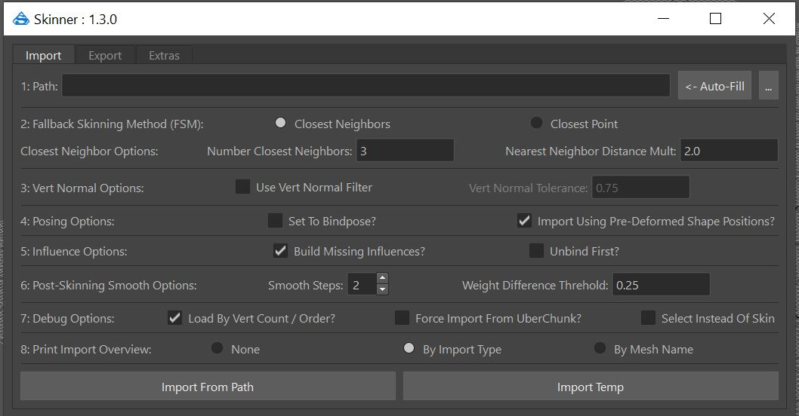
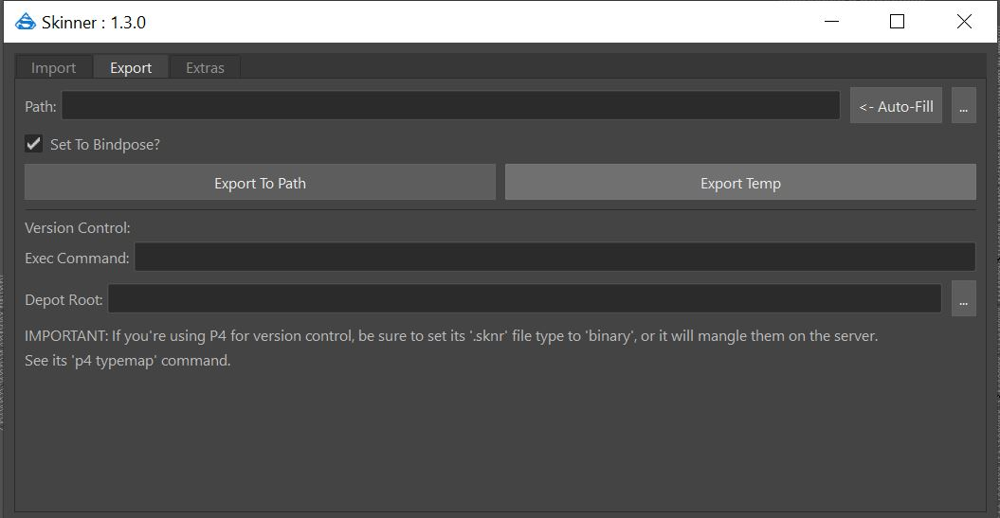
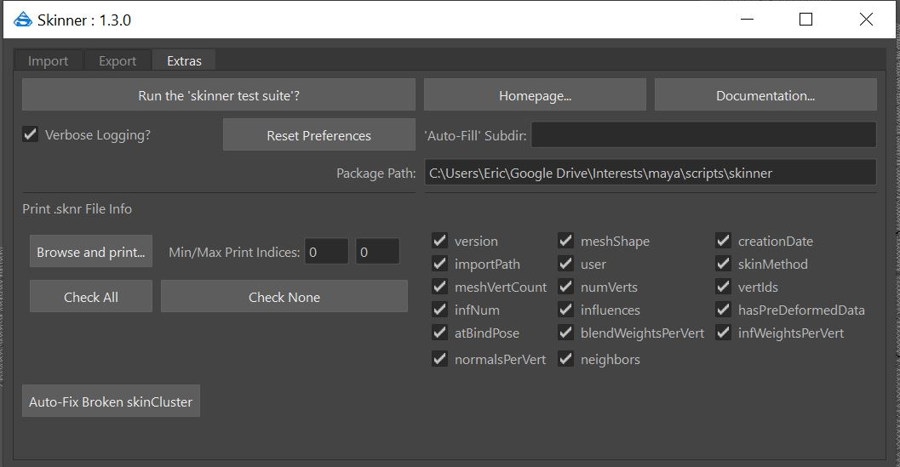

**Table Of Contents**
- [Overview](#overview)
  * [Disclaimers](#disclaimers)
  * [Donate For Usage](#donate-for-usage)
  * [Export Features](#export-features)
  * [Import Features](#import-features)
  * [Other Features](#other-features)
  * [Usage Examples](#usage-examples)
  * [Why this tool](#why-this-tool)
  * [Similar Tools](#similar-tools)
- [Help](#help)
- [Requirements](#requirements)
- [Integrating Into Your Pipeline](#integrating-into-your-pipeline)
- [Access the Maya Tool UI](#access-the-maya-tool-ui)
  * [Tool UI Overview](#tool-ui-overview)
    + [Import Tab](#import-tab)
    + [Export Tab](#export-tab)
      - [Interacting With Version Control](#interacting-with-version-control)
    + [Extras Tab](#extras-tab)
- [Skinner Concepts](#skinner-concepts)
  * [The .sknr file format](#the-sknr-file-format)
  * [SkinChunks](#skinchunks)
  * [UberChunks](#uberchunks)
- [Using the Skinner API](#using-the-skinner-api)
  * [Accessing Help](#accessing-help)
  * [Common Functions and Classes](#common-functions-and-classes)
    + [skinner.core](#skinnercore)
    + [skinner.window](#skinnerwindow)
    + [skinner.utils](#skinnerutils)
  * [API Examples](#api-examples)
- [About Me](#about-me)

# Overview
Skinner is a tool for [Autodesk Maya](https://www.autodesk.com/products/maya/overview) designed to make "exporting and importing skin weights on polygonal mesh fast, easy, and full featured".  Having both a consumer-facing UI and scriptable API, it can be fully integrated into a professional production pipeline regardless of industry.

At high level, the Skinner tool works by exporting & importing ```SkinChunk``` data, discussed below.

## Donate For Usage

As of Feb 2023, Skinner has been open sourced.  But the developer would still appreicate any tips you'd like to provide.  

Please 'buy me a coffee' per the below suggested tipping rate:  https://www.buymeacoffee.com/akeric

* Student / Hobbiest / Indy dev : Free!  (but if you want to donate, I won't turn you down)
* Any other production : $25 a user.

## Disclaimers

Skinner is closed source code:  You are welcome to use it for your benefit for free without restriction, but the secret sauce is kept behind the counter.  

By using/installing it you're accepting all repsonsibilities for its usage, and release me from all liability: See the [License](https://github.com/AKEric/skinner/blob/main/LICENSE.md).

Skinner is obfuscated via [PyArmor](https://pyarmor.dashingsoft.com/)

If you have interest in purchasing the source for your production, please contact me for pricing info. ```warpcat at gmail dot com```

I have a full time job, this is a side project:  I will attempt to address all issues outside of work hours to the best of my abilities.

## Export Features
* Can export based on any combination of mesh/joint/vert/transform selection : It’s all converted into per-mesh ```SkinChunk``` instances for storage.
* Can export as many mesh/verts (as ```SkinChunk``` data) to a single ```.sknr``` file as needed.
* Exports both the current worldspace positions/normals for the provided SkinChunk verts, **and** (as of 1.1.0) the pre-deformed positions/normals (via intermediatObject query).  This allows the export to be done without needing to set the asset to the bindpose.
* Can ‘set to bindpose’ before export, or not. Generally not needed, but optional.

## Import Features
* Can import from multiple ```.sknr``` files at the same time & merge the data:  If there is same-named ```SkinChunk``` data in multiple ```.sknr``` files, the ones saved 'most recently' win the merge.
* Can import onto any combination of mesh/joints/vert/transform selection.  They’re all converted into mesh:vert chunks for import.
* Robust logic tree when importing:  If the tool can't load in weights based on 1:1 'vert count/vert order' (100% matching topology), it will 'fall back' to an algorithm of your choice to do the work, referred to as the ‘Fallback Skinning Method’ (**FSM**): It can either be ‘Closest Neighbors’ (a custom algorithm designed for this system, discussed below) or a more basic ‘Closest Point’.  Via the API (discussed below), you can even add your own custom 'closest point' function these call on.
* Options to build missing influences (joints), parenting them into existing hierarchies with parent-matched names, or build the joint hierarchy from scratch preserving the original transformational values / attrs / rotate order.
* Can either set to bindpose & unbind pre-existing skinning first, or append to the current skinning (in any pose) on import (see next bullet).
* Option to 'Import Using Pre-Deformed Shape Positions:  This allows for skinning to be loaded onto an asset that is in some deformed pose, without needing to set it to bindpose first.  But there is an option to 'Set To Bindpose' if desired, but generally isn't needed.
* Can import weights applying a ‘vert normal filter’ that aids in keeping ‘stretching’ verts at bay if there was overlapping mesh during export.
* High level import logic path, regardless if you’re importing onto multiple mesh, or some vertex selection:
  * Does a leaf mesh name match a ```SkinChunk``` name?
    * Yes
      * Does the ```SkinChunk``` only have a single influence joint?
        * Yes : Skin to that one joint 100%
        * No
          * Does it have the same vert count/order as the mesh?
            * Yes : Import by 1:1 vert IDs
            * No : Use that ```SkinChunk```’s point cloud and import by the ‘FSM’.
    * No
        * Can a single ```SkinChunk``` be found with the same vert count/order as the mesh? (presuming this option is set)
          * Yes : Import by 1:1 vert IDs.
          * No : Generate the ```UberChunk```, using its point cloud, import by the ‘FSM’.

## Other Features
* Supports duplicate mesh names in the Maya scene during import (the tool converts everything to long/absolute paths for import purposes).  
* Supports duplicate mesh names in the Maya scene during export, but a ```.sknr``` file can't store data for mesh with duplicate names (but you could store different ```.sknr``` files for each).
* Supports Maya’s linear, dual-quat, and weight-blended 'Skinning Methods':  What state its in during export will be the state applied during import.
* Not so much a feature, but an FYI:  Skinner only suppots skinCluster node's who's 'Normalize Weights' value is set to 'Interactive' (1): It does not support 'None' (0), or 'Post' (2).  If Skinner encounters such a non-conforming skinCluster, it'll prompt the user to 'auto-convert' it to 'interactive' before the operation is done (v1.0.14).  If the user cancels, no work is done.  Basically: ```skinCluster.normalizeWeights = 1```.
* Full featuerd backend API (fully docstringed with with Py3 type hint notation) ready to be plugged into your pipeline code.
* Verbose and robust results printed to the Script Editor / returned by the API for your own pipeline’s consumption.
* Full integration into your teams version control software.
* Introspection/printing of data in the custom ```.sknr``` file format (binary pickled Python data).
* Automated debug test suite you can run to confirm everything is working.
* Speed : Based on testing/profilling against Maya’s [Deformer Weights](https://knowledge.autodesk.com/support/maya/learn-explore/caas/CloudHelp/cloudhelp/2022/ENU/Maya-CharacterAnimation/files/GUID-A3079688-8A42-4C82-A3CF-070D95A9CE6F-htm.html) system, while it appears to export at roughly the same speed, it can be up to 5-10x faster on import, and provides substantially more options / ease of use.
* Verbose docstrings for all classes, methods, and functions, to be used with Pythons help function.

## Usage Examples
* Integrate into a rebuildable asset pipeline:
  * After skinning is performed on your 'SkeletalMesh'/'DeformedMesh' scene, export that Skinner data to disk.
  * Update mesh poly counts, names, etc in your ‘StaticMesh’ scene.
  * Via your pipeline code, When you regenerate your SkekeletalMesh from the StaticMesh, the Skinner tool handles all the mesh name changes, etc, loading weights onto matching mesh names where it can, and interpolating weights for new mesh / renamed mesh.
* You have good arm skinning in sceneA, and want to copy it to only a section of an arm in sceneB:
  * In sceneA, select just the verts you want to copy the skinning data on (could be on multiple mesh), and ‘export temp’.
  * In sceneB, select just the verts you want to copy the skinning data on (could be multiple mesh), and ‘import temp’.
* You want to copy skinning off sceneA to sceneB, but you know that sceneA has many joints that sceneB doesn’t:
  * That’s ok, just make sure you have ‘build missing influences’ checked during import, and the missing joints will be created/parented into the hierarchy for you.
* You’re copying skinning from one pair of ‘skinny jeans’ to a pair of ‘MC-hammer pants’: After you do, you transform the hip joints, and there are many ‘stretching verts’ between the legs, where the parachute-pants overlap.  No problem, reimport with the ‘Vert Normal Filter’ enabled to resolve this.
* You want to copy the weights between two mesh, that are the same topology, but different names, no problem:  Make sure “Load by vert count/order” is checked, and it’ll transfer the weights 1:1.
* You can generate a ‘weight depot’ on a server: Update your Skinner export pipeline code to export a ```.sknr``` file per mesh to the server, with the filename * ```<leafMeshName>_<vertCount>.sknr``` during export.  You’ve authored custom wrapper import code that for each mesh, see if it can find a name match in the ```.sknr``` files : If it does, load that data. If it doesn’t, find all the vertCount matches : For those matches, check and see if the vert order matches, and if so, load that data, regardless of name mismatch.
* Something it doesn’t do? Let me know for improvement. 
 
## Why this tool

Having built holistic art -> engine pipelines for multiple studios (Visceral/EA, Sledgehammer Games/Activision, 31st Union/2K), part of which include fully procedural rigging solutions and rebuildable static mesh -> skeletal/deformed mesh pipeilnes, one of the biggest areas that is missing in that rebuildable-asset pipeline-subset is a solid/repeatable skin weight export/import process in Maya, that supports radical chagnes to the source mesh during skin reapplication.

The tools that Maya provides lack features (+ can be slow), and there isn't anything I could find (free or $paid$) that had the feature-set I wanted/needed.  

This tool aims to alleviate any issues for the techart team regardless of industry.  It is in-use and proven in AAA game production.
 
## Similar Tools
If you are the author of any of the below tools and feel I have misrepresented your software in any way, please let me know for correction.
* Maya provided tools
  * [Deformer Weights](https://knowledge.autodesk.com/support/maya/learn-explore/caas/CloudHelp/cloudhelp/2022/ENU/Maya-CharacterAnimation/files/GUID-A3079688-8A42-4C82-A3CF-070D95A9CE6F-htm.html)
    * Skinner outperforms on speed, and provides a substantially better UI, and overall feature set.
  * [Weight Maps Export](https://knowledge.autodesk.com/support/maya/learn-explore/caas/CloudHelp/cloudhelp/2022/ENU/Maya-CharacterAnimation/files/GUID-7681F977-32D2-4FE4-A83D-E1C9FB2B402F-htm.html), [Weight Map Import](https://knowledge.autodesk.com/support/maya/learn-explore/caas/CloudHelp/cloudhelp/2022/ENU/Maya-CharacterAnimation/files/GUID-DD0E4715-294F-43EF-A70B-1EAD8389CA0E-htm.html)
    * This export skin weights as 2d images, but is entirely predicated on good/non-overlapping UV’s.  Skinner has substantially better import options available, and has no UV dependencies.
* [ngSkinTools](https://www.ngskintools.com/)
  * Provides robust layers-based solution for painting skin weights.  v1 has a limited featureset for exporting/importing of those weights.  But the [v2 API](https://www.ngskintools.com/documentation/v2/api/transfer/) seems to have expanded on this signifiantly.  Reading the v2 API docs, Skinner still has substantially more overall features.
  * Skinner would be a good compliment to this system.
* [mGear](http://www.mgear-framework.com/)
  * A robust procedural rigging solution, also includes code for skin weight export & import.
  * I’ve not researched the specifics, but even in [the docs](https://mgear4.readthedocs.io/en/latest/official-unofficial-workflow.html), they discuss using the ngSkin tools as part of their process.
  * API docs for skinning [here](http://www.mgear-framework.com/mgear_dist/mgear/core/skin.html).  The docs list ‘This module is derived from Chad Vernon’s Skin IO’, [here](https://github.com/chadmv/cmt/tree/master/scripts/cmt/deform).
  * Skinner would be good compliment to this system.
* [Zoo Tools](https://create3dcharacters.com/zoo2/)
  * Large suite of convenience tools/scenes across Maya, that includes rigging & skinning.
  * Their [Skinning Utilities](https://create3dcharacters.com/maya-tool-skinning-utilities/) tool brings a lot of Maya's tools together in one spot, but doesn't have anything for robust skin weight export/import.
  * Skinner would be a good compliment to this system.
* Others? Let me know.

# Help
Please log problems & requests in the [Issues](https://github.com/AKEric/skinner/issues) section of this github.
 
I welcome all suggestions & ideas for improvement.  As mentioned above I maintain this tool in my off-hours, and will try to address any issues to the best of my ability.

# Requirements
* It has been tested on Windows 10.  No reason it shouldn’t work on other OS’s, but no testing has been done.  There has been intent in the code to make it cross-platform compatible (no Windows-centric calls have been used).
* Python 3 (Maya 2022+)
  * This will not work on older versions of Maya running Python 2.7
* Based on your version of Maya, these Python packages available on Maya’s Python’s ```sys.path``` for import:
  * [Numpy](https://numpy.org/)
  * [Scipy](https://scipy.org/)

Maya 2022+ makes it very easy to install new Python packages via pip.  Maya 2022 docs [HERE](https://help.autodesk.com/view/MAYAUL/2022/ENU/?guid=GUID-72A245EC-CDB4-46AB-BEE0-4BBBF9791627).

Here is an example usage for Maya 2022 on Windows 10:

Open cmd shell **as admin** (on Windows at least).

Then line by line:

Install the ```scipy``` & ```numpy``` packages, one at a time, via ```pip```.  Note, it’s important to call to ```mayapy.exe``` specifically to execute it’s version of ```pip```.
Also, technically you only need to install ```scipy```, since it should auto-pull in the numpy dependencies it requires.
```
> C:\Program Files\Autodesk\Maya2022\bin\mayapy.exe -m pip install scipy
```
```
> C:\Program Files\Autodesk\Maya2022\bin\mayapy.exe -m pip install numpy
```
You can optionally provide a ```–target C:\some\path\to\target\dir``` at the end of the above lines if you want to install them to a custom location that Maya sees.

In either case, if the above worked, you should see (using numpy as an example):
```
> Downloading numpy-1.19.5-cp37-cp37m-win_amd64.whl (13.2 MB)
> Successfully installed numpy-1.19.5
```
They should install here by default, unless overridden by the ```–target``` arg:
```
C:\Program Files\Autodesk\Maya2022\Python37\Lib\site-packages
```
After restarting Maya, in the Script Editor, confirm the install:
```python
import numpy as np
import scipy as sp
print(np.__file__)
print(sp.__file__)
# C:\Program Files\Autodesk\Maya2022\Python37\lib\site-packages\numpy\__init__.py
# C:\Program Files\Autodesk\Maya2022\Python37\lib\site-packages\scipy\__init__.py
```
# Integrating Into Your Pipeline
All code lives in a ```/skinner``` Python package.  If you don't use git to manage code, you can easily download/extract via the provided zip. There are two ways:
* Access the [Releases](https://github.com/AKEric/skinner/releases) page, and download a zip of the most current release.
* Download a zip of this repro's head revision via the green Code button -> Download zip.

In either case:
  * I have had reports of the OS declaring this a 'trojan file' : My guess this is some sort of OS boilerplate based on the fact this is Python code that you're grabbing from the web.  You can take my word that this is not virus/trojan software, or just not use it.
  * Open the zip, and extract the ```/skinner``` subdir to a location on your Maya-Python ```sys.path```.
  * It is now available for import & usage in Maya.

To get a list of those paths, execute in the Script Editor:
```python
import sys
for path in sorted(sys.path):
    print(path)
```
To test that you have a successful install via the Maya Script Editor, run the test suite, and see the results:
```python
import skinner.core as skinCore
skinCore.test()
```
You can also access/run the test suite via the UI -> Extras tab (see how to open the UI below).

It should be noted that after install, importing ```skinner.core``` will run ```skinner.utils.confirmDependencies```, and will print any errors found to the Script Editor.

# Access the Maya Tool UI
You can launch the Maya Tool UI via this Python code:
```python
import skinner.window as skinWin
skinWin.App()
```
The App call can take multiple different args during creation, to help integrate your studio’s version control, and point to custom docs.  See more on these subjects below.

## Tool UI Overview
The UI is split into three main tabs, discussed below.

### Import Tab

The import tab acts on the selected (in any combination) verts, mesh, joints, transform/group nodes. They’re all converted to mesh:vert data, that is compared against the imported ```SkinChunk``` data:

* If mesh are selected:  All their verts are included.
* If joints are selected:  The mesh they influence are found, and all their verts are included.
* If verts are selected:  Those verts are included.
* If transform/group nodes are selected:  All child mesh in the full hierarchy are found, and their verts included.
Based on the mesh:vert’s being imported on:
* When ```.sknr``` files are imported the imported (target) ```SkinChunk```s first try to find a match by leaf mesh name in the (source) mesh:verts
* If they find a name match but the vert count/order differs, or if there is no mesh name match, they use the ‘Fallback Skinning Method’ (FSM) discussed below.
* If a FSM is used by mesh name match, then the FSM will only include the verts in the point cloud of that name matched ```SkinChunk```, for both speed and skinning accuracy.
* If no mesh name match is found, an ```UberChunk``` is generated that is a point cloud combination of all ```SkinChunk```s, and the FSM acts on that ```UberChunk``` data.

UI Elements:
* **Pathing**
  * Path: The path of the ```.sknr``` file(s) to import, based on:
    * Auto Fill : By default, this will be set to the directory/filename of the currently saved scene.  
      * For example, if the current scene is saved here: ```c:\path\to\my\awesome\file.mb```, pressing that button would fill the field with: ```c:\path\to\my\awesome\file.sknr```.
      * You can modify this to append extra subdir(s) to it via the 'Extras' tab (discussed below).
    * ‘…’ : Browse to a file(s, could be multiple) to import from.
* **Fallback Skinning Method** (FSM):  A FSM is used when the 'vert count/vert order' of the source mesh being imported into is different than the target mesh / ```SkinChunk``` with stored values.  This is a very common occurance (vert count/order changing during skin reimport), and the bulk of the work on the Skinner tool went into making a fast & good looking solution here.  If there is a 'vert count / vert order' match during import, then the weights are read on 1:1 with no interpolation.  But if not, a FSM can act on ```SkinChunk``` data (if there is a name match, but no vert count/order match) or on the ```UberChunk```, when there is no name match:  Your mesh will get skinned, no matter what.  The two built in algorithms are:
  * Closest Neighbors:  Custom algorithm written for this tool.  After considering barycentric coordinates, I felt there was a better way to calculate weights based on a point cloud of targets.  When this algorithm is used, for each vert needing skinning, this is the process used to generate the new weights:
    * Find the closest target (in the ```SkinChunk```/```UberChunk``` point cloud) vert to the source : Store that distance.  Say, it’s 1.0 cm
    * Based on the ‘Nearest Neighbor Distance Mult’ (default 2.0), generate a sphere around the source vert that is (closest vert distance * nearest neighbor distance mult) : In this example, the sphere would have a radius of 2.0 cm / diameter of 4.0 cm
    * Looking within that sphere, find up to the closest ‘Number Closest Neighbors’ target verts. In this example we’ll search for 3 total verts (the closest, + 2 others).
    * Generate distance for each of the target verts found to the source vert : Normalize those distance to all fit from 0 -> 1.0
    * Generate a list of all the influence weights for each of the target verts, and modify their weights based on the normalized distances:  Apply higher priority to closer target verts, lower priority to farther target verts.
    * Apply those weights to the source vert.
  * Closest Point : This is a simple system, that will find the closest target vert to source, and apply it’s saved weights.
  * Via the API calls though, you can add your own solutions if you don't like these (the UI won't support it without an update, but the back end will).
* **Use Vert Normal Filter**
  * If enabled, and if the FSM is being used:  Try to only find target verts who’s dot product vs the source vert are greater than the provided ‘Vert Normal Tolerance’.  
  * Dot product refresher: 1.0 : Both normals point the same direction. 0: Normal is perpendicular. -1 : Normal is opposite direction.  
  * The default is 0.75 : This means, match any target vert who’s normal is less than 25 deg different from the source (1.0 - 0.75 = 0.25).  If the FSM ‘Closest Neighbors’ is being used, and no matching normals can be found within the search area, it defaults to closest point.  
  * There is no 'one size fits all' value that will work here, it's entirely based on the topology of the current mesh being imported onto, and what was exported from, so some experimentation may be needed.
  * In the below example, I show an example where a pair of 'pants' that have extremely overlapping mesh are exported. Then imported onto a new pant leg with the vert normal filter turned off, then on, to show how this can reduce stretching:

* **Load By Vert Count / Order?**
  * If a FSM is triggered to be used, and this is checked: If there is no initial ```SkinChunk``` name match, the tool will search through all the ```SkinChunk```s to see if there is one that has the same vert count/order.  If one is found, then the skinning is loaded on 1:1 by vert ID.  If no match is found, or more than one match is found, then the FSM is used based on the point cloud of that ```SkinChunk```/```UberChunk```.  Usually you want this checked, and it makes it easy to copy skinning between the ‘same mesh’ that has ‘different names’.
* **Build Missing Influences:**
  * If this is checked, and any joints (influences) are missing in the current scene, they will be auto-created during skinning. If the mesh you're importing onto is already skinned, this will force it to go to the bindpose first. 
  * They will attempt to parent themselves to their original parents, if found.  Otherwise they’ll be parented to the world.  
  * Since the user has the option of **not** exporting Skinner data in the bindpose, if the tool detects for this at time of export, it will instead store the value in the joint's ```bindPose``` attr, which is the worldspace matrix at time of skinning.  But this value is only valid if the joint is connected to a ```dagPose``` node (users could delete them), so if that is missing, and it's not in the bind pose, the existing worldspace matrix is used, which is probably not what yout want, but all we can query under the circumstances.
  * The tool wil do its best to maintain the original local transformation values on the joint based on where they need to live in worldspace.  The overall process is:
    * Generate every joint needed (parented to the world), set the stored rotate order, and apply its stored worldspace matrix.
    * Look for the stored parent, and parent it if found.
    * After parenting, apply the original/stored local transformations (translate, rotate, scale, rotateAxis, jointOrient).
    * Compare the new worldspace matrix vs previous : If they're the same, leave the local transforms as is and continue.  If they're different, reset the stored world matrix.
  * Technically, this can be used to rebuild the entire skeletal hierarchy that was exported, in a scene with no matching skeleton.  In general you can find good success with this, but (if auto-created by this tool) always check your root joint's transformation values vs whatever is your standard, since while it will have the correct worldspace transformations applied to it, it's local values may be off-standard if using a shared skeleton.
  * If this is unchecked, and there are missing influences, the tool will error.
* **Import Using Pre-Deformed Shape Positions?**
  * Only applies if a FSM is being used:  If this is checked (v1.1.0), it allows you to load the skinning onto a already-skinned mesh in any pose.  It does this by using the 'pre-deformed' vert positions of the mesh (comparing against the saved 'pre-deformed' positions in the SkinChunk) in the FSM logic, instead of whatever pose it's currently in.  Generally you want this on.  If on, 'Set to Bindpose' is unecesary.  
  * In Maya, the term for the 'pre-deformed' mesh shape node is the 'intermediate object', and by default those nodes get an ```Orig``` suffix (like ```myMeshNameShapeOrig```).  The below gif shows their relationship to the deformation history, and how to enable/show and disable/hide them.  The 'green' mesh is the pre-deformed shape / intermedite object that is queried both at SkinChunk export time, and during import, if this options is checked:

* **Set To Bindpose:**
  * If 'Import Using Pre-Deformed Shape Positions' is checked, this should be unchecked.  If this is checked, and if you’re importing onto mesh that is already skinned:  Set it to bindpose before the import (or before the ‘Unbind First’ operation is ran, if checked  below).  If for any reason the bindpose can’t be set for a given ```dagPose``` node, there will be an error.  If there is no ```dagPose``` node for that ```skinCluster```/influences, it will be skipped without error.
* **Unbind First?**
  * If this is checked (and after ‘Set To Bindpose’ happens, if checked), if any mesh was previously skinned, it will be unskinned before the new weights are imported.  Why would you / wouldn’t you want this checked? : 
    * Check it: 
      * If you encounter certain skin import errors:  I’ve found certain ‘old’ skinCluster data doesn’t like being updated by this tool, and will error.  Checking this will apply ‘new skinning’, and get past that error.  
      * If you’re importing only a subset of vert data onto a ‘whole mesh’ and this is checked, you may ask, how does all the other verts get skinned?  The tool will first do a ‘default Maya bind’ on the mesh based on the saved influences, then load in the weight on the vert subset.
    * Uncheck it: 
      * If you’re copying a subset of vert weight data from one mesh to another, and want to keep the previous skinning on the rest of the mesh that wasn’t selected.
      * If for some reason your skeleton isn’t in the bindpose, and you want to leave it in that pose when the new weights are imported.
* **Force From ```UberChunk```?**
  * Mostly for debugging:  Make everything read in from the ```UberChunk``` point cloud using the active FSM.
* **Select Instead Of Skin:**
  * Mostly for debugging : If the ```SkinChunk``` data you’re importing from was a subset of verts, select the same subset of verts on the source mesh for preview purposes.
* **Smooth Steps:**
  * If a FSM is used, based on the below conditions, a smoothing pass can be ran to improve the results. 
  * If vert count of the source mesh being imported onto is greater than the the vert count in the ```SkinChunk```/```UberChunk``` target data being loaded from:  Smooth the resultant skinning based on the number of steps (since we have a smaller sample-set of weights than we do verts).  This is the same operation as Maya’s ‘Skin -> Smooth Skin Weights’ tool, with the ‘Required Weight Distance’ set to .5, and the ‘Smoothing Operation’ set to this value.
  * Continuing the logic, if the vert count of the source mesh is less than that of the target ```SkinChunk```/```UberChunk```, then no smoothing will be performed, since we have a larger target sample-set than we do source verts.
  * Note, if smoothing is performed, it only acts on source verts that are in different worldspace locations than target verts.  Since if they’re in the same position as an arbitrary target, you want to leave those weights 1:1 as-is.   
  * Set this value to 0 to disable entirely.  How this acts is also modifed by the 'Weight Difference Threshold', below:
* **Weight Difference Threshold:** : Added 1.1.7
  * If the 'Smooth Steps' (above) is a positive value, and those conditions are met:  Only verts that have a 'difference in weights' greater than this value will be smoothed.
  * The default is 0.25 : This means, that if abs(vertWeightA - vertWeightB) > 0.25, that vert's weights will be smoothed.
  * The **smaller** you make this value, the more verts will be smoothed, and the **larger** you make this value, the fewer verts will be smoothed.
* **Print Import Overview:**
  * In addition to ‘verbose logging’ that can be found in the Extras tab:  If this is checked, an ‘overview’ of the import will be printed to the Script Editor.  It has two modes that will change how the data is printed.  It should be noted that regardless of the mode picked, it will group the data by successful/unsuccessful import:
  * By Import Type: This will group the overview by the solution used to import the weights : by vert ID, by FSM, etc.
  * By Mesh Name : This will group the overview by the individual mesh names.
  * Try then and see the Script Editor for the results.
* **Import Buttons**
  * Import From Path : Import from the path set above.
  * Import Temp : Import from the last temp ```.sknr``` file saved by the ‘Export Temp’ button in the Export tab.
  
### Export Tab

The export tab acts on the selected (in any combination) verts, mesh, joints, transform/group nodes: All of this is converted in the mesh:vert ```SkinChunk``` data during export.

* If mesh are selected:  All their verts are included.
* If joints are selected:  The mesh they influence are found, and all their verts are included.
* If verts are selected:  Those verts are included.
* If transform/group nodes are selected:  All child mesh in the full hierarchy are found, and their verts included.

UI Elements:
* **Pathing:**
  * Path : The path of the ```.sknr``` file to export, based on:
    * Auto Fill : By default, this will be set to the directory of the currently saved scene.  
      * For example, if the current scene is saved here: ```c:\path\to\my\awesome\file.mb```, pressing that button would fill the field with: ```c:\path\to\my\awesome\file.sknr```.
      * You can modify this to append extra subdir(s) to it via the 'Extras' tab (discussed below).
    * ‘…’ : Browse to a specific file (exiting or not) to export to.
* **Set To Bindpose:**
  * If this is checked :  Set all exported mesh & their influences to their bindpose before the export.  For each ```dagPose``` node, if for any reason the bindpose can’t be set, there will be an error.  If there is no ```dagPose``` node, it will be silently skipped.
  * Usually you’d want this checked, since it will store out the accurate worldspace and local transforms of the joint influences, which is handy if they need rebuilt during import.  But if you’re copying off of some worldspace pose onto some other similar worldspace pose (and don't have concerns about missing influences needing be created), you’d want it unchecked.
* **Exporting:**
  * Export To Path : Export to the path provided above.
  * Export Temp : Export to a temp file, that can be imported via ‘Import Temp’ in the Import tab.

#### Interacting With Version Control
This section allows you to integrate this tool into your studios version control Python API.  
 
To date it’s only been tested with Perforce. (See the P4 Python API docs [here](https://www.perforce.com/manuals/p4python/Content/P4Python/Home-p4python.html)).
 
**Exec Command**
* This is your internal python code that should be executed to edit/add the ```.sknr``` file to your version control.
* It requires that you embed the Python string formatting (with the surrounding quotes) ```'%s'``` into it, as the pathway for this tool to pass the path of the ```.sknr``` file to your Python API.

Here is a made up example using a wrapper module/function around Perforce:
```python
import myCompany.myP4Tool as p4Tool; p4Tool.manageFile('%s')
```
Where it’s presumed that the manageFile function will both mark for add or edit the provide file, based on its current server status.

**Depot Root**
* If this is provided, it’s the local path to the root of your version control depot.
* The ‘Exec Command’ will only fire if the ```.sknr``` file being exported is somewhere under this path.

For example:
```
C:/myCompany/myProject/mySourcFiles
```
NOTE:  You can embed these paths into the UI on launch for your whole team, like so:
```python
import skinner.window as skinWin
skinWin.App(vcExecCmd="import myCompany.myP4Tool as p4Tool; p4Tool.manageFile('%s')", vcDepotRoot="C:/myCompany/myProject/mySourcFiles")
```
That way each individual user won’t have to enter the values… and get them wrong…

**IMPORTANT :**
* As shown in the UI:  If you’re using Perforce for version control (and this could equally apply to other VC apps like git, subversion, mercurial, etc, but they are untested) : You need to tell your VC software that the ```.sknr``` file type is ```binary```.
* By default, many will add new file types as ```ascii```, and this will corrupt the ```.sknr``` data once on the server.  Your local file will work fine, but anyone else that pulls down a version (or if you sync to someone else’s version), it will be broken.
* For Perforce, see the [p4 typemap command](https://www.perforce.com/manuals/v19.2/cmdref/Content/CmdRef/p4_typemap.html) to switch these types, or talk to your VC administrator for a site-wide update.
* REMEMBER: When you add a new ```.sknr``` file to your VC software, before you submit, confirm its file type is ```binary```!

### Extras Tab

* **Run the ‘skinner test suite’?**
  * This runs a unit test on the skinner tool, generating a new scene, auto exporting/importing ```.sknr``` weights as a test.
  * Press this button to test the tool any time!  Check the Script Editor for results.
* **Homepage...** 
  *  Link to this github repo.
* **Documentation...**
  * Launch these docs (that you're reading now).
  * Note, you can override the docs this button launches for your team via the below code, so as to provide custom docs for this tool, specific for your project/team.
```python
skinWin.App(docsOverride="www.someSite.com/path/to/docs.html")
```
* **Verbose Logging** : If this is checked, print information to the Script Editor. If unchecked, mostly only Errors and Warnings will show up.
* **‘Auto-Fill’ Subdir :**
  *  If this is populated, this is a subdir(s, could as deep as needed) that will be appended to the '<- Auto-Fill' buttons in the Export & Import tabs.  
  *  This is handy if in your production, you always save skin weights in a subdir relative to the current scene:  This field makes it easy to update the ‘Auto-Fill’ button with that subdir.  
  *  For example, Let's say that subdir is called ```rigData```, and eveyrthing rigging & skinning related goes in there : If your current scene is saved here ```c:\path\to\my\awesome\file.mb```, when you press the 'Auto Fill' button, the resultant path would be : ```c:\path\to\my\awesome\rigData\file.sknr```
* **Skinner Package Path** : (v1.1.3) Just an FYI to tell the user where the Skinner tool is installed.
* **Print sknr file info…**
  *  The ```.sknr``` file format is binary : It’s pickled Python data.  Because of that, it’s not human readable.  This section can be used to browse to, and print information in a ```.sknr``` file to the Script Editor, based on the checkboxes set, and the min/max print indices (to help limit how much info is printed for large files).
# Skinner Concepts
  
## The .sknr file format
A ```.sknr``` file is a Python [pickled](https://docs.python.org/3/library/pickle.html) (binary) ```list``` of ```SkinChunk``` instances.

When importing multiple ```.sknr``` files at the same time, those lists are merged together. During the merge, ```SkinChunk```s that have a mesh name clash with other ```SkinChunk```s are pruned out:  Only the ‘most recently exported’ ```SkinChunk``` will win the battle.  This can allow your team to assemble ‘weight depots’ of data, and you can be assured regardless of what is selected for import, only the most recent data will make it through.

## SkinChunks
When you interactively select ‘items’ for export, regardless of what is selected, ultimately they’re turned into mesh:vert 'chunks' of data.  Each mesh:vert chunk being exported turns into a ```SkinChunk```.  A ```SkinChunk``` stores things like:
* The leaf mesh shape (not transform) name it was saved for.
* The version of the Skinner tool that was used during export (as of 1.0.16).
* The total number of verts on that mesh at time of save.
* The specific target vert IDs on that mesh being exported (could be a subset, or for the whole mesh).
* The influence joint list.  Plus their worldspace transforms, parents, (and as of 1.1.1) local transform values and rotate orders.
* Both the worldspace position for each target vert exported in the current pose, and (as of 1.1.0) the 'pre-deformed' worldspace positions (from the intermediateObject).
* Both the worldspace normal for each target vert exported in the current pose, and (as of 1.1.0) the 'pre-deformed' worldspace normals (from the intermediateObject).
* If there is valid 'pre-deformed' point/normal data to query (per the above two bullets): If the mesh is in the bindpose during export, this extra data isn't stored, since it's the same as the current worldspace positions, and is redundant/unecessary.
* Whether or not it's in the bindpose when the SkinChunk is created (v1.1.1).
* The influence weights for each target vert exported.
* The ‘blend weights’ for each target vert exported, if the ‘skinning method’ is ‘weight-blended’.
* The influence weights for each target vert exported.
* A sample of vert neighbors based on input args.
* The ‘skinning method’ : Linear, dual-quat, weight-blended.
* The date it was saved, and the name of the user.

A single ```SkinChunk``` can be imagined as a point cloud of data for a specific mesh, where each point represents an original vertex position (and other data) in worldspace associated with that mesh shape name.

## UberChunks

When importing on mesh (shape nodes), the tool tries to find a ```SkinChunk``` that has a name match with a mesh shape.  What happens if it can’t?  An ```UberChunk``` is formed.  The ```UberChunk``` is a combination of every ```SkinChunk``` provided, generating a single giant point cloud of data to import off of, which helps address issues when you’re importing onto mesh that have no name match (or, based on the import options, no vert count/order match) in the skinChunks provided.

# Using the Skinner API

The Skinner tool is designed to be fully integrated into a rebuildable asset pipeline.
 
The ```skinner.core.py``` module is what holds the functions you’re after.
 
## Accessing Help

All functions & classes are fully doc-stringed.  Please use the Python help function to get more information for them.  
 
For example:

Full module help:

```python
import skinner.utils as skinUtils
help(skinUtils)
```

Specific function help:

```python
import skinner.core as skinCore
help(skinCore.exportSkin)
exportSkin(items=None, filePath=None, verbose=True, vcExportCmd=None, vcDepotRoot=None, setToBindPose=True)
    For the selected/provided mesh, export their SkinChunks. This is a wrapper
    around generateSkinChunks and exportSkinChunks. The main export point interface.
 
    If you're using Perforce as your version control software, please read important
    notes in the docstring of exportSkinChunks about it.
 
    Parameters:
        items : None/dict : Default None : If None, use the active selection of verts,
            mesh shapes, or transforms in any combination (and will search for all
            child mesh).
            Otherwise expected to be the return from utils.getMeshVertIds: key:value pairs of
            "meshShapeName":[list of int vert ids]
        filePath : string/None : If string, save it to that location. If None,
             open an file browser for the user to choose. If the file/dir doesn't yet
             exist, the tool will create that directory tree. It is presumed this
             file is writable, if it exists.
         verbose : bool : Default True : Print the results of the operation?
         vcExportCmd : None / string : Default None : See docstring of exportSkinChunks.
         vcDepotRoot : None / string : Default None : See docstring of exportSkinChunks.
         setToBindPose : bool : Default True : Passed directly to generateSkinChunks,
             see its docstring for details.
 
     Return : bool / None : If any errors, return False. If export successful,
         return True. If the operation is canceled, return None.
```

## Common Functions and Classes

### skinner.core

The most common functions you’ll interact with are in the ```skinner.core.py``` module:
* ```exportSkin``` :  This is a higher level wrapper for:
  * ```generateSkinChunks``` : Create a list of ```SkinChunk``` instances for export.
  * ```exportSkinChunks``` : Export the ```.sknr``` file based on the provided ```SkinChunk``` list.
* ```importSkin``` : Capture the return from this to get the results of the import operation in your calling code.  This is a higher level wrapper for:
  * ```importSkinChunks``` : Import ```.sknr``` file, and return the list of ```SkinChunk``` instances.
  * ```setWeights``` : Apply the list of ```SkinChunk``` data to the provided mesh/vert data.  The return from this is what is returned by the calling ```importSkin``` : Check its docstring for details.  
    * This is where you can override the which 'closest point' algorithm is used by either FSM, via the ```closestPointFunc``` arg, if you don't feel the [scipy.spatial.KDTree](https://docs.scipy.org/doc/scipy/reference/generated/scipy.spatial.cKDTree.html) (the default) algorithm is doing a good enough job.  
    * The built in functions that can be passed to this include ```closestPointKdTree``` (the default) and ```closestPointBruteForce``` : You can see the example function ```closestPointExample``` if you want to write your own and roll it in here.
* ```test``` : Run the Maya test suite.
* ```printWeightFile``` : Print info about the contents of the provided ```.sknr``` file to the Script Editor.

And classes:
* ```SkinChunk``` : The ```getByMeshName``` and ```getByVertCountOrder``` static methods are very handy
* ```UberChunk``` : Is generated by merging multiple ```SkinChunk``` instances together.

### skinner.window
As mentioned above, the UI code lives in Skinner ```skinner.window.py```

To get information on the ```__init__``` args for that Window class:
```python
import skinner.window as skinWin
help(skinWin.App.__init__)

__init__(self, vcExecCmd=None, vcDepotRoot=None, autoFillSubdir=None, 
         docsOverride='https://github.com/AKEric/skinner/blob/main/README.md', *args, **kwargs)
    Init our main window.  There are certain defaults that you may want exposed
    to your team consistently:  That's what the below parameters are for.
    
    Parameters:
        ...
```

### skinner.utils

Many utility/shared functions live in ```skinner.utils.py```

## API Examples

These use the same mesh generated by running the test-suite ```skiner.core.test()```

There are many additional args for these functions, as discussed above, use ```help(functionName)``` to see their parameters/args.

```python
import skinner.core as skinCore

skinnedMesh = ["cubeA", "planeA", "planeB"]
filePath = "C:/temp/maya/skinner/test.sknr"
```

Export/Import based on the selected mesh.  In all cases, if you omit ```filePath```, a file browser dialog will be auto-launched for the user.

```python
# Export:
mc.select(skinnedMesh)
exportResult = skinCore.exportSkin(filePath=filePath)

# Import:
mc.select(skinnedMesh)
importResult = skinCore.importSkin(filePaths=filePath)
```

Export/Import based on specific mesh names:

```python
# Export:
exportResult = skinCore.exportSkin(items=skinnedMesh, filePath=filePath)

# Import:
importResult = skinCore.importSkin(items=skinnedMesh, filePaths=filePath)
```

Export/Import temp data based on the selection:

```python
mc.select(skinnedMesh)
skinCore.exportTempSkin()

mc.select(skinnedMesh)
skinCore.importTempSkin()
```

# About Me

Sr Director of Techart  at [31st Union](https://thirtyfirstunion.com/) (2K)

https://www.linkedin.com/in/pavey/

I also maintain some wikis:
* http://mayamel.tiddlyspot.com/
* http://pythonwiki.tiddlyspot.com/
